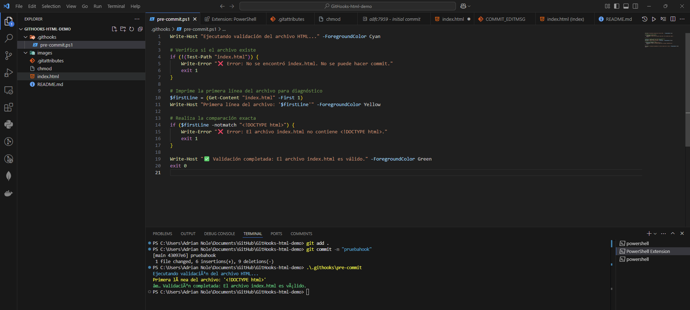

# GitHooks HTML Validator 🚦

Este proyecto implementa un **pre-commit hook** que valida que el archivo `index.html` contenga la etiqueta `<!DOCTYPE html>` en su primera línea. Esta etiqueta es fundamental en archivos HTML para declarar el tipo de documento y asegurar que el navegador interprete correctamente el contenido.

---

## 📋 **¿Qué son los Git Hooks?**

Los **Git Hooks** son scripts que se ejecutan automáticamente en momentos específicos del ciclo de vida de Git. Existen varios tipos de hooks:

- `pre-commit`: Se ejecuta **antes de que se realice un commit**. Si falla, el commit no se completa.
- `post-commit`: Se ejecuta después de realizar un commit.
- Otros ejemplos: `pre-push`, `post-merge`, etc.

En este proyecto, utilizamos un **hook pre-commit** para validar el contenido del archivo `index.html`.

---

## 🛠 **¿Qué hace este hook pre-commit?**

El hook realiza lo siguiente:

1. Verifica si el archivo `index.html` existe.
2. Lee la primera línea del archivo.
3. Valida si la primera línea contiene `<!DOCTYPE html>`.
4. Si la validación falla, muestra un error y detiene el proceso de commit.
5. Si la validación es exitosa, permite continuar con el commit.

---

## 📜 **Código del Hook pre-commit.ps1**

Este es el contenido del script `pre-commit.ps1`:

```powershell
Write-Host "Ejecutando validación del archivo HTML..." -ForegroundColor Cyan

# Verifica si el archivo index.html existe
if (!(Test-Path "index.html")) {
    Write-Error "❌ Error: No se encontró index.html. No se puede hacer commit."
    exit 1
}

# Lee la primera línea del archivo
$firstLine = (Get-Content "index.html" -First 1)
Write-Host "Primera línea del archivo: '$firstLine'" -ForegroundColor Yellow

# Valida si contiene <!DOCTYPE html> (ignorando mayúsculas/minúsculas)
if ($firstLine -notmatch "(?i)^<!DOCTYPE html>") {
    Write-Error "❌ Error: El archivo index.html no contiene <!DOCTYPE html>."
    exit 1
}

Write-Host "✅ Validación completada: El archivo index.html es válido." -ForegroundColor Green
exit 0

